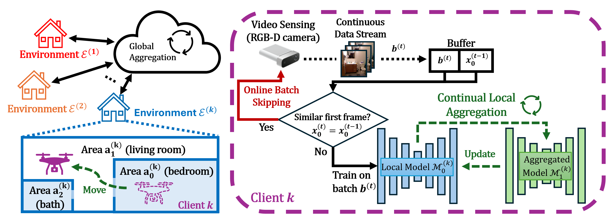

# Federated Continual Learning for Monocular Depth Estimation in Dynamic Indoor Environments (DCOSS-IoT 2025)
Allen-Jasmin Farcas, Hyun Joon Song, Radu Marculescu

Contact: allen.farcas@utexas.edu

<div align="center">
    <a href="./">
        
    </a>
</div>

## 1. Create the virtual environment
```bash
conda create -n loca python==3.10 -y
conda activate loca
conda install -c pytorch -c nvidia faiss-gpu -y
pip3 install torch torchvision torchaudio paramiko scp tqdm pandas scipy scikit-learn h5py matplotlib quadprog
```

## 2. Download and unzip NYUv2 dataset
Download the NYUv2 dataset from [here](https://drive.google.com/file/d/1ztEgv8B_xJ3ISKLIFgJ3dWSLSE86loL-/view?usp=sharing).
Unzip the downloaded file such that you have the following structure:
```
LOCA
--- nyu_data
    --- data
        --- nyuv2_test
        --- nyuv2_train
        --- nyuv2_test.csv
        --- nyuv2_train.csv
```

## 3. Prepare datasets
Run `python generate_dataset.py` to create the local datasets for all users.

## 4. Run experiments
Edit the experiment configuration `experiments/exp.bash`. Check the `generate_configs.py` for more details on
the parameters used.

Run `bash experiments/exp.bash` to create the configuration.

Finally, run `bash execs/exec_exp1000_run1.bash` to run the experiment number 1000 run 1. You can edit this script to contain your desired
experiments to run.